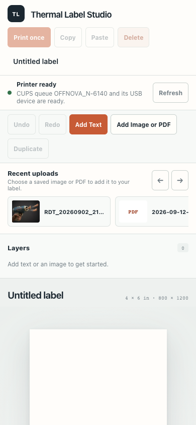
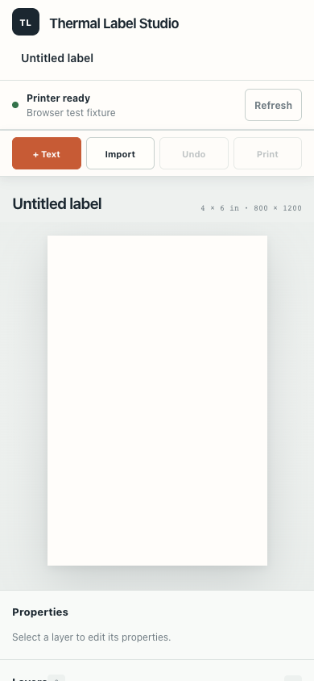
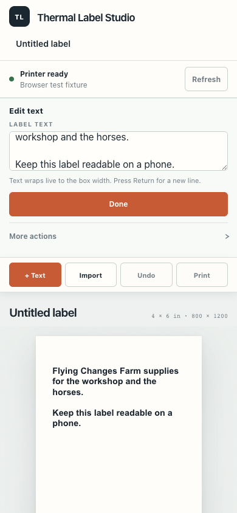

# Phone editor review

The phone layout puts a focused text field and common actions beside the label preview. Text wraps using browser font measurements, preserves blank lines, and saves when leaving the field. Secondary item actions, layers, and upload history use disclosures.

## Screenshots

All captures use a 390 × 844 browser viewport. The before capture is the existing Pi deployment. After captures are the local production build with a clearly labeled printer-status fixture; they are not device deployment or physical-print evidence.

| Existing editor | Phone layout | Text editing |
| --- | --- | --- |
|  |  |  |

## Browser checks

- Add Text focuses the text entry field.
- Text wraps within its measured width; explicit blank lines retain their spacing.
- Done followed by Undo restores the previous text; Redo restores the edit.
- Switching text layers saves the field draft.
- Tapping the canvas preserves the field draft.
- Long text grows the text box and blocks printing if it passes the label edge; shortening it shrinks the box and restores printing.
- No horizontal document overflow at 320, 390, 430, 768, or 1280 pixels.
- An intercepted local print request produced a bitmap and displayed the simulated acceptance receipt. The route was local and intercepted; no physical printer received a request.

Deployed to https://pizero.tail8797e7.ts.net/ on 2026-09-19 from code commit `ff2ff60`. All seven served files matched the production build by SHA-256. The live 390px browser verified focused text entry, wrapping, blank-line spacing, no horizontal overflow, printer readiness, and zero console errors. The previous static files are backed up on the Pi. A real phone keyboard and physical output remain human acceptance checks.

Source checks: 106 tests, TypeScript checks, full production build, and `git diff --check` passed.
